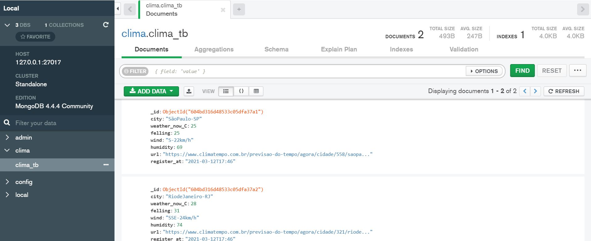

# scrapy_climatempo

Objetivo: obter a temperatura atual utilizando o scrapy, armazená-la em BD e automatizar o processo

## Requisitos

 [x] utilizar scrapy para obter informações do clima agora em uma cidade.

 [x] obter a temperatura no momento

    [x] obter umidade

    [x] sensação 

    [x] vento

 [x] atualizar o scrapy para obter informações do clima agora de X cidades.

 [x] salvar os dados persistentemente.

 [x] realizar o deploy

 [x] obter informação de hora em hora

 ### Como desenvolver

  0. É necessário instalar previamente o [Python3](https://www.python.org/) e o [MongoDB](https://docs.mongodb.com/manual/tutorial/install-mongodb-on-windows/). 
  1. Siga as instruções para iniciar o serviço do MongoDB e conectar ao BD disponível localmente. Garanta que o serviço pasta_de_instalacao_mongodb\bin\mongod.exe tenha sido inciado corretamente.
  1. clone o repositório com `git clone https://github.com/mabittar/scrapy_climatempo`
  2. mova o caminho para o diretório do projeto `cd scrapy_climatempo`
  3. crie o venv com Python 3.6 ou superior `python -m venv .`
  4. ative o venv `.\Scritps\activate`
  5. instale as dependências utilizando `pip install -r requirements.txt`
  6. mova para o diretório do scrapy `cd ct`
  7. para obter os dados utilize o comando `scrapy crawl climatempo -o clima.csv` será criado um arquivo clima.csv com as informações obtidas.
  8. para salvar os dados obtidos diretamente no Banco de dados utilize `scrapy crawl climatempo`

  ## Como fazer o Deploy? 

  0. faça o cadstro em https://www.zyte.com/scrapy-cloud/
  1. faça o login com `shub login`
  2. será solicitado a chave API que pode ser obtida no painel do usuário após o login no site zyte.com
  3. utilize o comando `shub deploy numero_do_projeto` para fazer o deploy, consulte o numero do seu projeto no dashboard em https://www.zyte.com
  4. a partir do dashboard garanta que os serviço está agendado conforme desejado. PS: já há uma configuração para rodar o serviço a cada hora, mas essa configuração precisa ser ajustada manualmente no Zyte (aba schedule)

